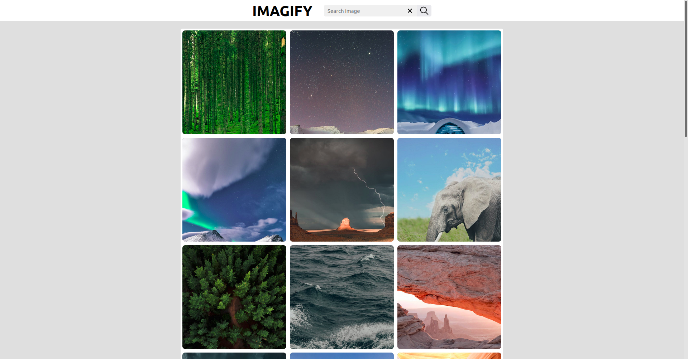

# Imagify
Full-stack project, a Photo Album using:
- Pexels API,
- Node.js 
- Express.js for the backend
- Javascript
- CSS and HTML
- Sass
- Intersection Observer for lazy loading images and infinite scroll features.

Link to live project(takes some seconds to start because of Glitch server): https://spangle-stupendous-noodle.glitch.me

# Screenshots
__Initial page -__ 
This is the first page loaded(you can go back to it by clicking the Imagify logo).

### Responsiveness
Tablet screen size

Smartphone screen size

__Image hovered -__
When the image is hovered more information about the author and Pexels page appears. In smaller screen that information is displayed by default.

__Searched theme page -__
Page after user input in the search bar.
Note how the search bar state changes slightly when clicked, to indicate you can input text.

### Error/important messages
Displaying backend error messages in a user-friendly manner to indicate what's happening

__Server error -__
If the API limit is reached or an XSS atack is attempted

__No results -__
A message indicates when there are no results at all for a searched theme.

__No more results -__
In the bottom of the page a message indicates there are no more results for this searched theme.

__Fullscreen mode__
When you click an image, the fullscreen mode opens

